## Task1
Linear Regression is a machine learning algorithm based on supervised learning. It performs a regression task. Regression models a target prediction value based on independent variables. It is mostly used for finding out the relationship between variables and forecasting. This function takes 2 variables let say first variable X and second variable Y where Y is column matrix(vector) of order n and X is a m*n matrix which gives m cofficents(a1 to am) and 1 intercept (a0) in a hypothesis function

&nbsp;&nbsp;&nbsp;&nbsp;&nbsp;&nbsp;&nbsp;&nbsp;&nbsp;&nbsp;&nbsp;&nbsp;&nbsp;&nbsp;&nbsp;&nbsp;&nbsp;&nbsp; <b>h = a0 + a1*b1 + a2*b2+ ... + am-1*bm-1+ am*bm</b>&nbsp;&nbsp;&nbsp;&nbsp;,where bi = xi conveted by PolynomialFeatures().fit_transform() function. To achieve the best-fit regression line, the model derived using LinearRegression().fit() aims to minimize the Cost Function(J) [The Root Mean Squared Error(RMSE) between predicted Y value (y_pred) and true Y value (y)]. 

### add some line for prediction too 2-3 lines

<!-- Then it performs the task to predict a dependent variable value (y) based on a given independent variable (x). LinearRegression().fit() Implements Linear Regression Algorithm. -->

## Task2
<!-- Calculate bias and var -->
## Task3
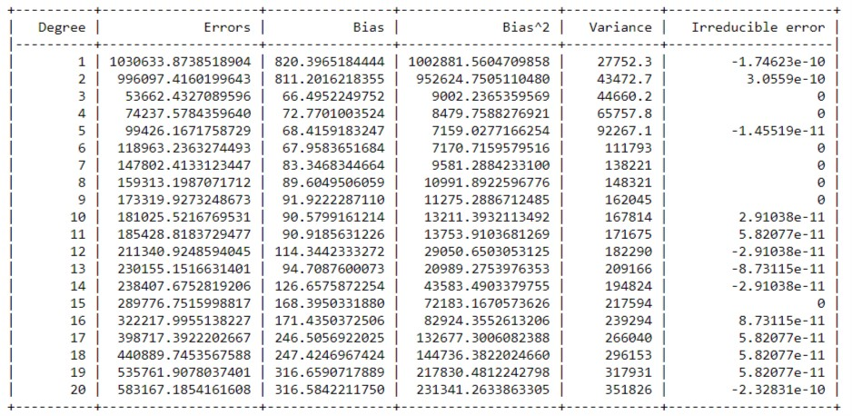
<!-- Comment on IE -->

## Task4
<!-- Observation -->

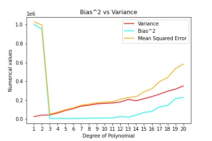

From the above graphs and tabulated values, we observe that with an increase in the complexity of the model the bias first decreases and then increases whereas variance continously increases. 

**Bias** : As the degree of hypothesis polynomial increases, the function becomes more flexible, allowing it to better mould itself to fit the training dataset. Hence, the error on the test dataset also decreases. Because the bias (the average difference between the predicted and actual values) effectively captures this error, we see a steadily deceasing trend in the bias values with an increase in degree of the hypothesis function. But eventually error starts increasing after polynomial of degree 3 which hints at the fact that the data is best modelled by a degree 3 hypothesis, and a further increase in degree of the hypothesis would be frivolous

**Variance** : The variance of the models shows a general increase with an increase in the degree of the hypothesis. This is because as the degree of the polynomial increases and it becomes more flexible, it also becomes more susceptible to minor variations in the training dataset. Hence, each time the model is trained, the increased flexibility of the higher degree polynomials causes the coefficients to turn out significantly different due to differences in the training set. Hence, the high variance on the test dataset. The squared bias decreases drastically in transition from degree 2 to degree 3 polynomial. This is because of the nature of the test data, It looks very similar to a cubic equation. That is the reason that all the higher polynomial fit the curve well and the bias remains almost the same

**Overfitting** : The phenomenon of memorization can cause overfitting. That is with increase in the number of features, or complexity/flexibility of the model (essentially increasing the degree of the model to best fit the training data) the model extracts more information from the training sets and works well with them. However at the same time it will not help us generalize data and derive patterns from them. Thus the model may perform poorly on data sets that have not been seen before. This is reflected in the increase in variance with increase in complexity. Thus the model is said to be overfitting. Higher degree polynomials can usually be overfitting. Overfitting occurs when we try to describe the learning rules based on a relatively small number of observations. 

**Underfitting**: When a model is underfit, it does not perform well on the training sets and does not perform well on the test sets either. That is it fails to capture the underlying trend of the date. Furthermore for lower degree polynomial models, we observe a high bias but low variance. The reason being, the model may not be able to perform well even on existing training data since the lower degree polynomials are unable to capture all features of the training data. Yet the variance is high, since the model is consistently performing poorly. Therefore lower degree polynomials can usually be underfitting.

## Graphs
| | | | |
|:-------------------------:|:-------------------------:|:-------------------------:|:-------------------------:|
|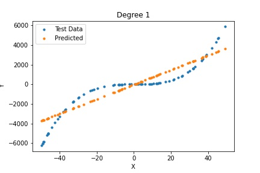|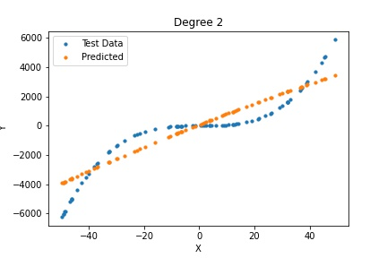|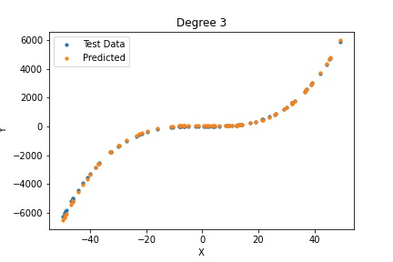||
||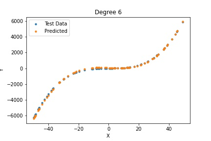||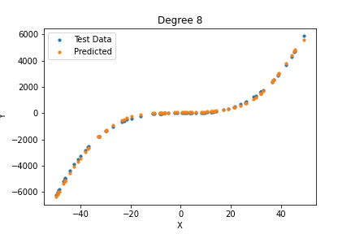|
||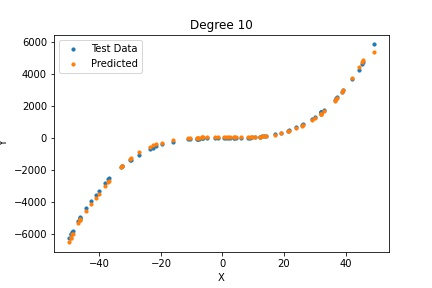||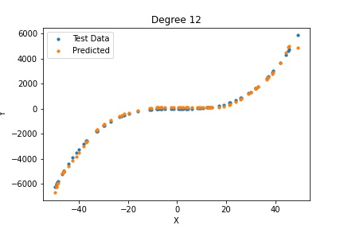|
||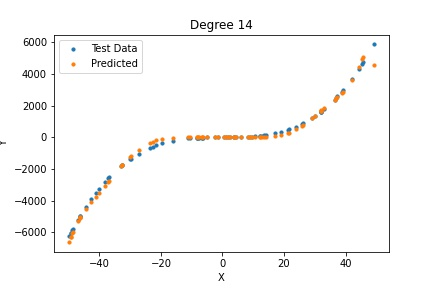|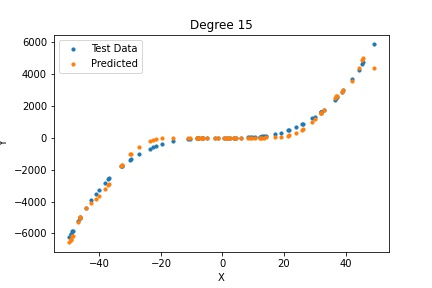|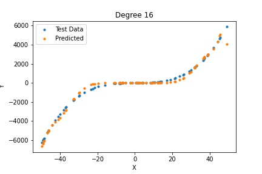|
|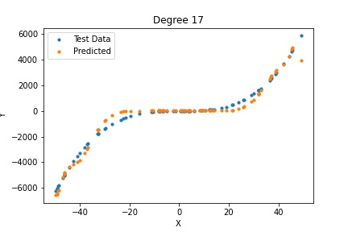|||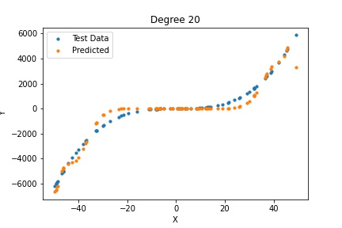

